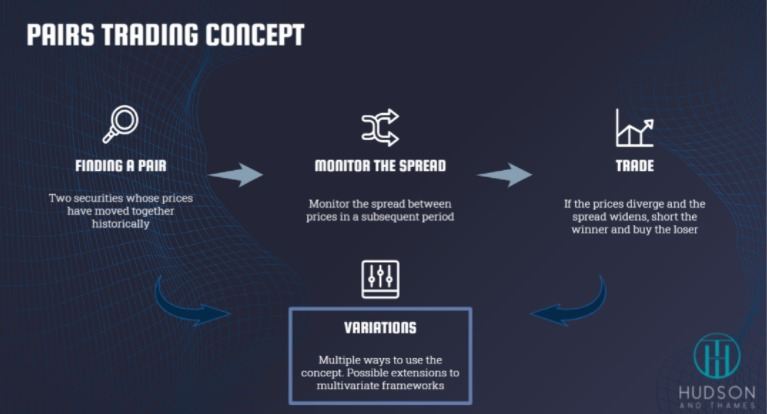

# PairsTradingStrategy
Pairs trading is a strategy in which we use various statistical methods to  pair-up 2 stocks whose prices have moved together in the past and are potentially market neutral. We monitor the spread between the prices and when these prices diverge, we short the winner and buy the loser. The paper can be read from [here ](https://www.researchgate.net/publication/227624374_Pairs_Trading).

 

There are two approaches:
